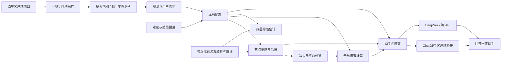

# 黑流树海辅助应用开发计划

更新日期：2026-10-02。工作名称暂用 rouge。

## 当前交付进度（0.9）

已提供可运行的 Python / PySide6 简易测试应用。当前主线为 ChatGPT 客户端内部工具管道，服务商 API 仅为备选；没有前台聊天自动化，也未接入订阅额度共享 API 或 Codex 分析后端。

- ChatGPT：普通会话列表、绑定、发送一次、后台回读已完成本机往返验证；前台保持不变。真实本机调用上下文保存在独立本地配置，异常发送不自动重试。
- 采样：Arknights.exe 窗口 WGC 一键/自动采样已验证后台新帧。最小化标记不可用，自动模式继续监测恢复。
- 属性与技能：公开资料整理的 30 人名单、32 个职业档案和全部 87 个技能的条件估算模型，培养/潜能及部分自身天赋、272 件藏品数据审计、128 件含数值/条件/部分机制的规则；按[自适应格式](OUTPUT_FORMAT.md)显示基础属性与时序，按技能实际能力生成伤害/治疗/费用/防护等栏目，未拥有的效果整栏隐藏。特殊选项按当前干员/技能隐藏。无限、切换、限用、部署触发、布子弹药分别处理，条件不足的时间和总量保持未知。名单来源和机制边界见 [COMMON_OPERATOR_COVERAGE.md](COMMON_OPERATOR_COVERAGE.md)，不宣称全服前 30 或完整战斗模拟。
- 培养读取：基础属性只读，仅等级允许模拟调整；首批三名详情页和机械师模组页已实际验证后台读取与自动应用。身份、阶段、等级、信赖、潜能、所选技能、各技能等级及装备模组分别读取，缺失项逐项显示。同一干员跨页合并确认字段，切换干员后使用独立档案；其他布局仍需实机验证。
- 资料：431 份可获得干员/职业形态属性档案、30 名干员条件技能规则、272 件藏品、105 个候选关卡及敌人参考资料固定于可追溯数据快照。名单外干员技能伤害未实现时显示未知。官方生还案例全服接口匿名访问要求授权，目前用公开分职业榜单及后续实战资料补充候选，没有虚构全局名次或使用率。
- 本局读取：持有栏藏品、总数、队伍身份及可确认培养自动进入计算；233 个已校验藏品图标，39 个变体无独立参考图，相近图标不强行确认。队伍左侧当前培养优先于账号卡片等级；未进阶的等级受精英阶段上限限制。潜能/信赖等本局未确认字段明确标记账号参考。
- 本局记忆：跨页持续合并并落盘，重启恢复同一局；只有手动“开始新局”清空。实时增减保留历史，缺失帧不当作删除，进阶后旧模组/专精留在历史并重新核对当前适用性。队伍/图标开发样本回放已覆盖，其他布局仍需验证。
- 招募来源：应急人形/时钟标识独立于金色已进阶标记、身份和精英徽标识别；当前机械师精二 90 级和三个技能专精 3 已在队伍样本确认。来源变化或离队后再次加入不直接沿用历史培养。应急标识区域确认无标识时只确认非应急，其他招募来源及专属增益仍待扩展。
- 战斗时序：已接入 30Hz 参考事件时钟，联合计算已排程伤害/治疗、初动、充能、弹药与周期；18 个普攻及 19 处技能动画参考待模板验证，14 个普攻缺资料（含首批三名）。实战目标、移动、弹道自动跟踪及未排程分项仍待扩展，见 [TIMING_MODEL.md](TIMING_MODEL.md)。
- 待完成：探索布局/战斗地图视觉识别、隐藏节点与掉落预测、难度环境修正、更多本局增益与条件机制及界面优化。

下文保留完整目标与后续计划；实际已实现范围以此节和 README 为准。

## 已确认的目标

- 平台：Windows 桌面应用。
- 游戏主题：明日方舟集成战略「沉沦者的黑流树海」。
- 游戏运行环境：Windows 原生客户端，通过用户选定的游戏窗口读取画面。
- 使用方式：在探索过程中提供地图、节点、掉落与战斗情报。
- 地图识别覆盖探索地图布局与战斗关卡地图。
- 难度由用户自由选择；目标结局可预设，配置可保存。
- 采样支持应用内一键采样和实时自动采样，日常使用不要求用户提交截图或数据文件。
- 内置聊天分析入口，支持两条连接路径：ChatGPT Windows 客户端聊天桥接，以及 DeepSeek 等服务商 API。
- ChatGPT 路径由用户在助手中提问，客户端聊天分析后将回答回传助手；API 路径支持用户配置地址、模型和凭据。
- 首批伤害计算支持凯尔希·思衡托、凛御银灰（用户所写“凌御银灰”）和机械师，并考虑藏品加成。
- GPT-6 用于 Codex 开发；应用内聊天模型另行配置，两者配置互相独立。

## 待确定

- 客户端画面分辨率、Windows 显示缩放与窗口模式。
- ChatGPT 内部工具管道已在本机当前版本验证；跨版本兼容性及远程停止生成仍需扩展。API 的具体服务商、模型和凭据由用户后续配置。

## 已确认的六项能力

| 能力 | 输入与处理 | 输出及验证要求 |
| --- | --- | --- |
| 地图类型识别 | 探索画面的节点位置、连线与已知标记；战斗画面的关卡名称、地形与部署区 | 分别输出探索模板与战斗关卡候选，保留多解；匹配分数不当作概率 |
| 节点类型预判 | 当前层、地图通路、可见节点、已出现类型与已验证生成规则 | 隐藏节点的候选类型及排除理由；有统计依据时再显示条件概率 |
| 藏品掉落估计 | 获得渠道、藏品解锁状态、本局状态、影响掉落的效果与历史记录 | 可获得藏品池；估计概率必须带样本量、适用条件与区间，缺数据则显示未知 |
| 干员伤害预估 | 干员培养、技能、模组、藏品效果；目标敌人及难度参数 | 单次伤害、持续输出与技能期间总伤害；显示假设及尚未支持的机制 |
| 战斗节点敌人信息预览 | 已确认的关卡、普通或紧急版本、难度、关卡数据与特殊修正 | 敌人列表、关键能力和属性；未确定关卡时分别显示候选关卡信息 |
| 节点掉落预览 | 节点类型、事件或关卡身份、奖励规则、本局条件 | 区分固定奖励、条件奖励和随机奖励池；未来随机结果只能给范围或有依据的估计 |

## 首版流程与界面

连接游戏窗口 → 一键采样或开启自动采样 → 识别地图与关键状态 → 点击节点查看情报或计算伤害 → 保存本局进度。识别不确定时允许修正，修正是补救操作，不作为正常使用的必经步骤。

界面建议使用左侧地图与识别标记、右侧节点情报、下方本局状态。干员伤害预估作为独立面板，可选用节点中的敌人作为计算目标。

顶部提供连接状态、一键采样、自动采样开关和暂停控制；右侧可切换到聊天页，选择 ChatGPT 客户端或已配置的 API，使用当前局情报辅助问答。提问和回答均在助手界面显示。

每条结果标注来源、数据版本以及“已确认 / 候选 / 未知”。未知节点变为可见后，记录实际结果，用于校验规则和积累统计样本。

### 难度与结局配置

- 难度选项来自当前游戏数据版本，涵盖该版本支持的难度；用户可以手动选择，并查看截图识别的建议值。
- 结局预设包含目标结局、所需条件和已完成步骤；在节点情报中提示相关条件、缺失条件和已知冲突。
- 预设只影响助手的判断与显示，实际游戏状态仍以用户游玩和画面确认结果为准。
- 允许保存多个配置，开始新局时选择；本局记录锁定其使用的数据版本，防止静默混用。
- 修改难度后重新计算敌人属性与伤害，并将不适用于新条件的统计结果标记为未知；修改结局后更新条件提示。
- 无法读取或尚未覆盖的新难度、结局与修正效果应明确显示缺少数据。

### 画面与识别

- 由用户选择采集窗口，显示窗口名称和最新采集时间。
- 应用直接获取原生客户端画面，首版同时包含一键采样和可暂停的自动采样；调试样本导入只用于开发验证。
- 自动采样连续监测画面变化，按页面类型执行局部识别；采样频率与识别频率分开控制，优先处理最新帧，避免任务堆积。
- 关闭、最小化、失去有效画面或切换目标窗口时更新采样状态，不把旧画面当作新的游戏状态。
- 游戏资料由应用内置数据快照和更新机制提供，队伍与藏品在对应页面可见时自动读取、保存，随后续画面更新。
- 只凭当前地图无法知道尚未显示的藏品身份和干员培养状态；尚未采集到的状态标记为未知，正常游玩时打开相关页面即可自动补齐，不要求导出数据或另行截图。
- 首批页面类型：探索地图与节点详情，其次是队伍、藏品和战斗准备页。
- 探索地图和战斗地图分别建立识别样本；结合节点详情中的关卡名称与地图形状，避免仅凭相似地形认定关卡。
- 地图识别先验证几何布局与图标匹配；本地 OCR 用于需要读取的关卡名称、数字及队伍信息。
- 地图模板匹配利用可见证据消除歧义，不根据人物动画的位置直接确定出生节点。
- 未读到的信息标记为未知，过期画面显示提示，识别结果允许用户修正。
- 原生客户端的多种分辨率、Windows 显示缩放、窗口模式、地图缩放、遮挡与加载画面必须进入验证样本。
- 找不到游戏窗口时显示未连接，由用户重新选择采集目标。

### 本局状态与计算

- 按局保存状态和决策记录；同一局内连续读取，避免只根据单张图下结论。
- 当前局仅由用户手动重置；不会根据队伍数量、藏品数量或画面变化自动新建一局。切换页面、短暂漏读和助手重启都保留已确认状态。真实变化更新当前清单，历史记录继续保存，切换新对局时请点击“开始新局”。
- 地图表示为节点和通路组成的图，并记录当前位置、已知出口、已探索节点和未知区域。
- 节点推断使用图上的路径距离和生成规则；节点坐标之间的直线距离不能代替通路距离。
- 规则矛盾时报告冲突，保留可审查的输入和解释，不将空候选伪装成已识别。
- 藏品掉落池与掉落概率分开保存。概率统计按相关条件分组，不把不同难度或增益的记录直接混在一起。
- 首批覆盖凯尔希·思衡托、凛御银灰、机械师。培养、技能、模组和机械师特勤培训状态优先从画面与版本数据取得，无法确认时显示缺失状态。
- 物理、法术与真实伤害分别计算；藏品按适用对象、叠加规则、层数、触发条件和持续时间处理，不能把所有效果合成一个百分比。
- 计算同时展示未持有藏品的对照值、当前藏品下的结果及每项效果的贡献；未实现的相关藏品使计算标记为不完整。
- 具体支持范围、伤害来源归属与验证用例见 [DAMAGE_SPEC.md](DAMAGE_SPEC.md)。
- 首版伤害输出为指定条件下的估计；位移、丢失目标、特殊阶段、元素机制等未建模因素必须在计算结果中列出。
- 知识数据记录出处、适用版本和更新时间；每次游戏更新后检查相关规则。

## 技术方案建议

当前采用 Python + PySide6 简易桌面界面、OpenCV / OCR 本地识别及独立 Node 后台聊天桥接。游戏后台采集和普通 ChatGPT 会话往返已在本机验证；多分辨率识别和客户端跨版本兼容性继续验证。

Electron + React + TypeScript 保留为候选方案。若界面原型或窗口采集验证表明更适合，再调整技术选择；已安装的 React 技能不构成必须采用 React 的理由。

采集模块在游戏窗口和开发回放样本之间切换。识别模块只接受图像，输出带位置、候选和依据的结构化观测；节点推断、掉落估计和伤害计算接受结构化参数、返回结果，各自通过相同接口验证。

游戏数据独立于程序代码，使用可追溯的版本快照。UI 不直接读取原始数据表，不承担规则运算。更新规则后可回放保存的样本，判断变化是否符合预期。

OCR 方案先通过真实中文游戏截图对比识别效果与速度，再确定依赖。首轮不以付费模型 API 为必要条件；固定布局和规则优先由本地识别及计算完成。

本地保存用户设置、知识数据和局内记录。截图默认只用于处理；需要保留调试样本时由用户主动保存。

采样控制与两种聊天连接见 [SAMPLING_AND_CHAT.md](SAMPLING_AND_CHAT.md)。聊天使用可追溯的观测快照与本地计算结果，模型提供解释和辅助分析；伤害数值由计算模块产生。ChatGPT 后台管道已完成当前本机版本往返验证，尚不保证跨版本兼容。

## 开发顺序与交付标准

1. **连接验证与 v0.1 采样/伤害**：先验证 ChatGPT 客户端提交、回答回读与取消能否完成完整流程，再建立连接 adapter；实现游戏窗口连接、一键与自动采样、连续状态记录，以及三名首批干员的伤害计算和已验证藏品效果。API 路径先以本地测试连接验证，不发起付费调用。
2. **v0.2 地图与节点情报**：加入探索与战斗地图识别、隐藏节点候选、敌人资料与奖励预览；支持难度选择与结局预设，用保留验证样本和游戏核对结果验收。
3. **聊天与效果扩展**：后台 ChatGPT 桥接、API 备选和当前观测/计算上下文已在 0.2 提前完成；后续接入跨页面本局状态，扩大藏品、模组和特殊机制覆盖。
4. **后续掉落估计**：实现奖励记录与条件统计；拥有可靠规则或足够样本的条目才输出概率，其余保持未知。
5. **稳定版**：连续探索状态恢复、数据更新及 Windows 安装包；验证安装、升级后的设置保留、卸载和快捷方式启动。

关键验收：在用户 Windows 原生客户端的一次探索中，完成地图识别、节点情报查询和支持范围内的伤害估算。概率功能单独验收，避免把“有奖励池”误判为“已能预测具体掉落”。

识别验证分别报告误匹配、漏识别和拒绝判断，关注错误确定结果的比例；模板测试按真实截图划分调试集与保留验证集。速度目标在取得真实样本、确定硬件后制定，不预先宣称已经达到。

配置验收：同一关卡切换难度后不残留旧属性；未知修正不被忽略；结局预设切换后相关条件提示正确更新；新局不继承上一局的队伍、藏品与已完成节点。

## 已取得的开发样本

两张用户提供的原图已保存在 `samples/native-client/`，分别为完整探索地图和选中“遗忘时间”作战节点后的详情界面。尺寸分别为 1596×1198 和 1597×1195；这些是附件尺寸，不能直接推断客户端设置或 Windows 显示缩放。

它们用于初步标注和回放，不构成识别准确率的独立验证集。第二张图的详情面板遮挡部分地图，且底部有截图工具提示，应验证遮挡不会抹除前一帧已知地图。

正常使用及后续样本收集由应用采样完成，用户无需自行提交游戏截图或数据文件。样本的可见事实记录见 `samples/native-client/manifest.json`。

## 已核实的资料与验证边界

- [官方主题页面](https://ak.hypergryph.com/is/blackflowofdrowningseekers)。
- [官方 PC 客户端说明](https://ak.hypergryph.com/news/0717)：确认原生 PC 客户端使用环境。
- [官方制作组通讯 #67](https://ak.hypergryph.com/news/9684.html)：确认主题名称与上线情况。
- [官方 7 月 20 日更新](https://ak.hypergryph.com/news/9683)：说明关卡、事件与藏品行为会随更新修正。
- [PRTS 主题资料](https://prts.wiki/w/%E6%B2%89%E6%B2%A6%E8%80%85%E7%9A%84%E9%BB%91%E6%B5%81%E6%A0%91%E6%B5%B7)：搜索索引可核实平面地图、行动力与追猎机制；页面正文本次读取超时，详细规则仍需结合游戏与资料复核。
- [地图识别与节点推断参考项目](https://github.com/ega0123/hlsh-helper)：作者记录了固定地图模板匹配、路径距离规则和节点数量约束的实现；它提供候选集合，不提供节点概率。参考项目的自述不等于本项目已经完成验证。
- [黑蓑影语集地图工具](https://arkrog.com/tool/blackflowmap)：候选地图资料来源，页面正文尚未取得。
- [社区游戏数据快照](https://github.com/Kengxxiao/ArknightsGameData)：已固定 commit `a550f5e048bb94e7cdefc6eb97a4091f0c4c7add`，保留下载回执；尚未完整解释所有生成规则与本局修正。
- [Electron 窗口采集文档](https://www.electronjs.org/docs/latest/api/desktop-capturer/)：备选方案支持枚举窗口与屏幕采集源；实际原生客户端兼容性尚未验证。
- [凯尔希·思衡托资料](https://m.prts.wiki/w/%E5%87%AF%E5%B0%94%E5%B8%8C%C2%B7%E6%80%9D%E8%A1%A1%E6%89%98)、[凛御银灰资料](https://prts.wiki/w/SilverAsh_the_Reignfrost)、[机械师资料](https://prts.wiki/w/%E6%9C%BA%E6%A2%B0%E5%B8%88)：用于确定首批计算的机制范围，具体数值仍需按当前游戏版本校验。
- [ChatGPT 客户端后台管道参考](https://github.com/kajmahal/chatgpt-conversations-mcp)：复用用户指定的本机模块，采用内部工具接口，不使用前台聊天操作；许可见 licenses/。
- [DeepSeek Chat Completions](https://api-docs.deepseek.com/api/create-chat-completion/)与[Responses 协议说明](https://api-docs.deepseek.com/guides/responses_api/)：自定义服务商 API 的协议参考。
- [OpenAI API 概览](https://developers.openai.com/api/reference/overview)与[流式输出文档](https://developers.openai.com/api/docs/guides/streaming-responses)：API adapter 的候选协议参考。

当前交付为可运行的 0.9 简易测试应用、固定数据、开发样本、自动检查与本机验收记录；完整目标中的待办范围见本文件顶部。
